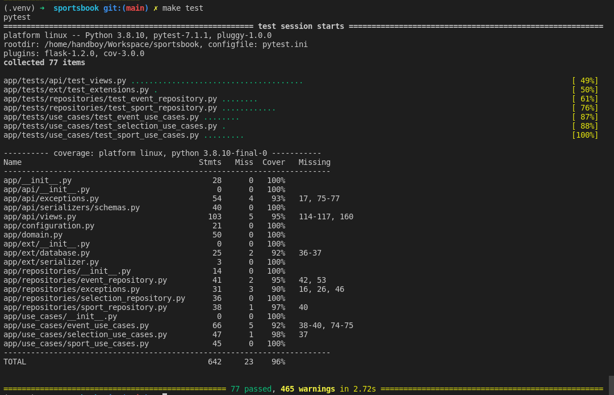

# Getting Started

Full code on [github](https://github.com/HandBoy/sport-book).

## Setup Development to run the project
```shell
# Python path
$ which python3

# Create virtual enviroment
$ virtualenv --python='/usr/bin/python3' .venv

# Activate virtual enviroment
$ source .venv/bin/activate 

# Install requirements
$ make install

# Run project
$ make run

```

## Documentation
You can acces the documentation online: [link](https://handboy.github.io/sport-book/)
To run locally:

```shell
# Run and access Mkdocs
$ mkdocs serve

INFO     -  Building documentation...
INFO     -  Cleaning site directory
INFO     -  Documentation built in 0.30 seconds
INFO     -  [19:46:59] Serving on http://127.0.0.1:8000/
INFO     -  [19:46:59] Browser connected: http://127.0.0.1:8000/
```

## Tests

```shell
# Run all tests
$ make tests

# Run all the tests in a particular test file
$ pytest tests/folder/test_resource.py

# Run only particular test class in that file
$ pytest tests/folder/test_resource.py::TestResouce
```


* These warnings are thrown by flask-apispec plugin.

## Project Struture
The project apply some clean archtecture to share responsibilities:

- Api: Contains all endpoints.
- Use Cases: This layer contains application specific business rules. It encapsulates and implements all of the use cases of the system.
- Repositories: Contains logic to send and retrieve data from database.
- Domain: The entities that encapsulate enterprise wide business rules.

Above we have a explanation about all project folders:
```
.
├── app
│   ├── api                 # Api Views, exceptions, and Serializers
│   ├── configuration.py    # Config environment variables
│   ├── conftest.py         # define the fixture functions to test files.
│   ├── domain.py           # The entities enterprise wide business rules.
│   ├── ext                 # Flask extensions
│   │   ├── database.py
│   │   ├── __init__.py
│   │   └── serializer.py
│   ├── __init__.py         # Create Flask App
│   ├── repositories        # Interfaces to do comunication with database
│   │   ├── event_repository.py
│   │   ├── exceptions.py
│   │   ├── selection_repository.py
│   │   └── sport_repository.py
│   ├── schema.sql          # Sql Script to init the database.
│   ├── tests               # All project tests
│   └── use_cases           # This layer contains application specific business rules.
│       ├── event_use_cases.py
│       ├── __init__.py
│       ├── selection_use_cases.py
│       └── sport_use_cases.py
├── docs                    # Project Documentation
├── Makefile
├── pytest.ini
├── README.md
└── requirements            # Project Requirements
    ├── base.txt
    └── dev.txt

```

## Next Steps

<ul class="task-list">
    <li class="task-list-item">
        <input type="checkbox" disabled="" checked="">
        Filters: All (sports/events/selections) with a name satisfying a particular regex
    </li>
    <li class="task-list-item">
        <input type="checkbox" disabled="">
        Filters: All (sports/events) with a minimum number of active (events/selections) higher than a threshold
    </li>
    <li class="task-list-item">
        <input type="checkbox" disabled="">
        Filters: Events scheduled to start in a specific timeframe for a specific timezone
    </li>
    <li class="task-list-item">
        <input type="checkbox" disabled="">
        Try fix warnings from tests.
    </li>
        <li class="task-list-item">
        <input type="checkbox" disabled="">
        Add authorization in endpoints.
    </li>
        <li class="task-list-item">
        <input type="checkbox" disabled="">
        Expecify the error when send data different expected by scheme.
    </li>
        <li class="task-list-item">
        <input type="checkbox" disabled="">
        Add pagination in list endpoints.
    </li>
        <li class="task-list-item">
        <input type="checkbox" disabled="">
        Remove code duplication between repositories.
    </li>
        <li class="task-list-item">
        <input type="checkbox" disabled="">
        Add partial update.
    </li>
        <li class="task-list-item">
        <input type="checkbox" disabled="">
        Register Api exception.
    </li>
        <li class="task-list-item">
        <input type="checkbox" disabled="">
        Increase coverage.
    </li>
    
</ul>